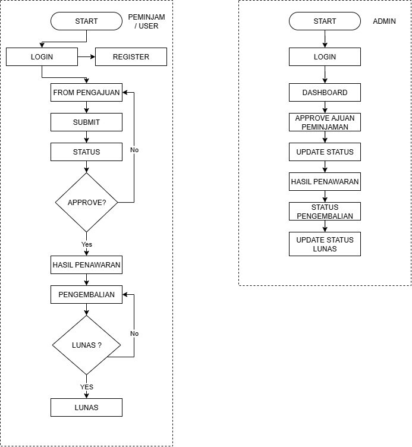
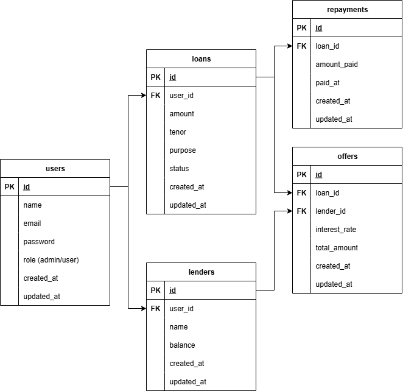

# UtangDong - Prototype Platform Pinjaman Online

## 1. Penjelasan Singkat Aplikasi

**UtangDong** adalah prototype platform pinjaman online sederhana (loan marketplace) yang memungkinkan:

- **Borrower**: 
  - Registrasi/Login
  - Submit aplikasi pinjaman (jumlah, tenor, tujuan)
  - Melihat status aplikasi atau penawaran dari lender (dummy data)
- **Lender/Admin**:
  - Login ke dashboard Filament
  - Melihat daftar aplikasi pinjaman masuk
  - Approve / Reject aplikasi pinjaman
  - Melihat pengembalian pinjaman (repayment)

**Alur MVP**:  
Borrower registrasi/login → isi form pengajuan pinjaman (jumlah, tenor, tujuan) → submit aplikasi → status pending → lender/admin login dashboard Filament → lihat daftar aplikasi → approve/reject → status aplikasi diperbarui → borrower melihat status atau penawaran dummy → jika disetujui, borrower melakukan repayment → status aplikasi menjadi completed → lender/admin memantau pembayaran. 

---

## 2. Diagram Flow Aplikasi

> Diagram ini menunjukkan alur utama antara Borrower dan Lender/Admin dalam MVP UtangDong.

---

## 3. Diagram ERD

> Diagram ERD ini menunjukkan struktur database 5 tabel utama: `users`, `lenders`, `loan_applications`, `offers`, `repayments`, beserta relasinya.

---
