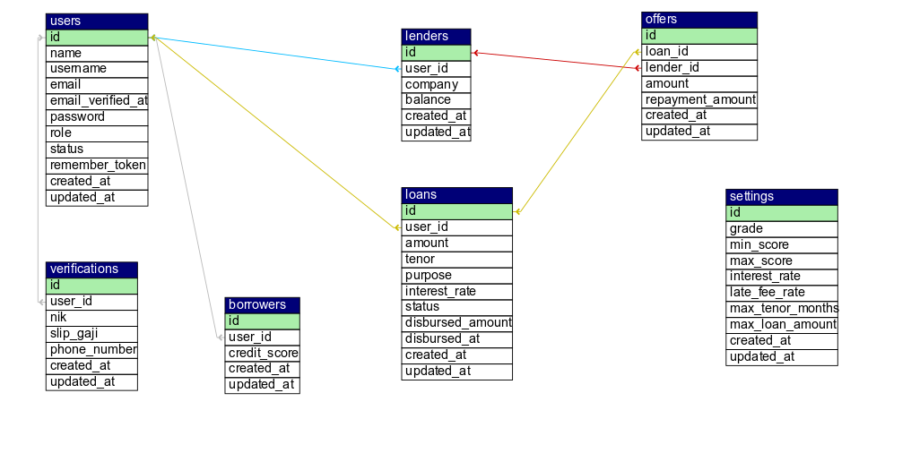

# Dokumentasi Developer – UtangDong

## 1. Overview
**Nama Aplikasi:** UtangDong  
**Tipe:** Marketplace Pinjamans  
**Stack:**  
- Backend: Laravel  
- Admin Panel: Filament  
- Database: MySQL / MariaDB  

**Tujuan:**  
Memfasilitasi peminjaman uang antara borrower (peminjam) dan lender (pemberi pinjaman), dengan admin yang mengatur verifikasi dan grade bunga.  

**Roles:**  
- **Borrower (User):** Mengajukan pinjaman  
- **Lender:** Memberikan pinjaman ke borrower  
- **Admin:** Mengatur verifikasi, menentukan grade bunga, mengelola sistem  

---

## 2. Fitur Utama
### Borrower
- Registrasi dan login  
- Mengajukan pinjaman (loan request)  
- Melihat status pinjaman  

### Lender
- Registrasi dan login  
- Melihat daftar pinjaman yang bisa didanai  
- Memberikan pinjaman melalui *offer*  
- Melacak dana yang tersedia dan digunakan  

### Admin
- Verifikasi borrower (dokumen NIK, slip gaji, nomor HP)  
- Menetapkan grade dan interest rate berdasarkan score  
- Mengatur pengaturan sistem (bunga, tenor maksimal, limit pinjaman)  

---

## 3. ERD

---

## 4. Alur Sistem
1. **Borrower**  
   - Registrasi → Lengkapi verifikasi → Ajukan pinjaman → Tunggu penawaran → Withdraw 
  
  

2. **Lender**  
   - Registrasi → Tambah saldo → Lihat daftar pinjaman → Buat tawaran → Masukan Tawaran → Tawaran Aktif  

   

3. **Admin**  
   - Verifikasi borrower → Tentukan grade, interest rate, max limit, and max tenor

   

---

## 5. Instalasi & Setup
  composer install
  npm install && npm run build