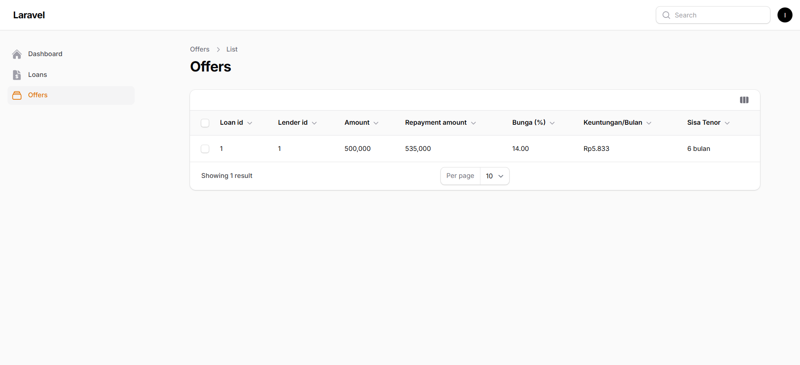

# 📘 Dokumentasi Developer – UtangDong

## 1. Overview
**Nama Aplikasi:** UtangDong  
**Tipe:** Marketplace Pinjaman  
**Stack:**  
- Backend: Laravel  
- Admin Panel: Filament  
- Database: MySQL / MariaDB  

**Tujuan:**  
Memfasilitasi peminjaman uang antara borrower (peminjam) dan lender (pemberi pinjaman), dengan admin yang mengatur verifikasi dan grade bunga.  

**Roles:**  
- **Borrower (User):** Mengajukan pinjaman  
- **Lender:** Memberikan pinjaman ke borrower  
- **Admin:** Mengatur verifikasi, menentukan grade bunga, mengelola sistem  

---

## 2. ✨ Fitur Utama
### Borrower
- Registrasi dan login  
- Mengajukan pinjaman (loan request)  
- Melihat status pinjaman  

### Lender
- Registrasi dan login  
- Melihat daftar pinjaman yang bisa didanai  
- Memberikan pinjaman melalui *offer*  
- Melacak dana yang tersedia dan digunakan  

### Admin
- Verifikasi borrower (dokumen NIK, slip gaji, nomor HP)  
- Menetapkan grade dan interest rate berdasarkan score  
- Mengatur pengaturan sistem (bunga, tenor maksimal, limit pinjaman)  

---

## 3. 📊 ERD


---

## 4. 🔄 Alur Sistem
### 1. Borrower  
Registrasi → Lengkapi verifikasi → Ajukan pinjaman → Tunggu penawaran → Withdraw  


### 2. Lender  
Registrasi → Tambah saldo → Lihat daftar pinjaman → Buat tawaran → Masukan Tawaran → Tawaran Aktif  


### 3. Admin  
Verifikasi borrower → Tentukan grade → Atur interest rate, max limit, max tenor  


---

## 5. ⚙️ Instalasi & Setup
Clone repo lalu jalankan:

```bash
# Install dependency Laravel
composer install

# Install dependency frontend
npm install && npm run build

# Salin .env
cp .env.example .env

# Generate key
php artisan key:generate

# Migrasi database
php artisan migrate --seed

# Jalankan server
php artisan serve
```
# 📖 Dokumentasi Penggunaan – UtangDong

## 1. 🔑 Login & Registrasi
- **Borrower** dan **Lender** bisa daftar lewat halaman registrasi.  
- **Admin** akun dibuat manual via seeder atau database.  

  
  
  

---

## 2. 👤 Borrower Flow
### 2.1 Dashboard Awal
Setelah login, borrower masuk ke dashboard awal.  


### 2.2 Lengkapi Verifikasi
- Upload **NIK**, **Slip Gaji**, dan **Nomor HP**.  
- Status awal: `requested` → menunggu admin.  
- Setelah diverifikasi: `verified`.  


### 2.3 Dashboard Setelah Terverifikasi
Dashboard menampilkan opsi pinjaman setelah status borrower diverifikasi.  


### 2.4 Ajukan Pinjaman (Loan Request)
- Masukkan jumlah pinjaman, tenor, dan tujuan.  
- Sistem menghitung bunga berdasarkan grade otomatis.  


### 2.5 Pantau Status Pinjaman
- **requested** → menunggu lender.  
- **active** → pinjaman sedang berjalan.  
- **completed** → pinjaman selesai.  

Borrower juga dapat melakukan **withdraw** dan melihat **history transaksi**.  


---

## 3. 💰 Lender Flow

### 3.1 Daftar Saldo (Top Up Pertama)
- Setelah login sebagai lender, langkah pertama adalah **mendaftarkan saldo**.  
- Tanpa saldo, lender tidak bisa mengakses fitur pendanaan.  


### 3.2 Dashboard Lender
- Setelah saldo terdaftar, lender diarahkan ke **dashboard lender**.  
- Dashboard menampilkan total saldo, dana terpakai, dan daftar tawaran.  


### 3.3 Pilih Pinjaman yang Tersedia
- Lender dapat melihat daftar pinjaman dari borrower.  
- Pinjaman bisa dipilih sesuai preferensi jumlah, tenor, dan bunga.  


### 3.4 Buat Tawaran (Offer)
- Masukkan jumlah dana yang ingin dipinjamkan dari saldo tersedia.  
- Sistem otomatis menghitung jumlah pengembalian (**repayment**).  
- Setelah submit, tawaran lender aktif pada loan terkait.  





---

## 4. 🛠️ Admin Flow
### 4.1 Verifikasi Borrower
Cek dokumen (NIK, slip gaji, nomor HP). Update status → `verified` atau `rejected`.  


### 4.2 Kelola Settings (Grade & Bunga)
- Atur **min/max score**.  
- Tentukan **bunga, late fee, tenor maksimal, limit pinjaman**.  


### 4.3 Monitoring
Pantau daftar user, loan, offer


---